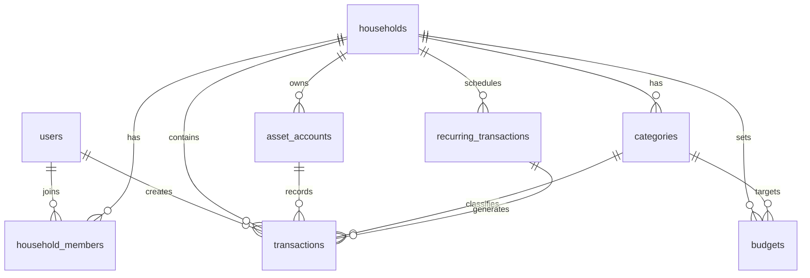

# PocketFree 가계부 DB 스키마 설계

> **DB명:** `account_book`  
> **작성일:** 2026-04-22  
> **목표:** 모든 유저가 사용하고, 가족/커플끼리 가계부를 공유할 수 있는 구조

---

## 전체 구조 다이어그램



---

## 테이블 목록

| # | 테이블명 | 설명 | 상태 |
|---|---------|------|------|
| 1 | `users` | 회원 정보 (카카오 OAuth) | ✅ 기존 존재 |
| 2 | `households` | 가계 그룹 | 🆕 생성 필요 |
| 3 | `household_members` | 가계 멤버 연결 | 🆕 생성 필요 |
| 4 | `asset_accounts` | 자산 계좌/지갑 | 🆕 생성 필요 |
| 5 | `categories` | 수입/지출 카테고리 | 🆕 생성 필요 |
| 6 | `transactions` | 거래내역 | 🆕 생성 필요 |
| 7 | `budgets` | 월별 예산 | 🆕 생성 필요 |
| 8 | `recurring_transactions` | 정기 거래 | 🆕 생성 필요 |

---

## 1. `users` (기존 - 수정 없음)

```sql
-- 이미 존재하는 테이블 (참고용)
CREATE TABLE users (
    id          BIGINT AUTO_INCREMENT PRIMARY KEY,
    email       VARCHAR(255) NOT NULL UNIQUE,
    nickname    VARCHAR(255) NOT NULL,
    provider    VARCHAR(255) NOT NULL,   -- 예: 'kakao'
    provider_id VARCHAR(255) NOT NULL,
    created_at  DATETIME DEFAULT CURRENT_TIMESTAMP,
    updated_at  DATETIME DEFAULT CURRENT_TIMESTAMP ON UPDATE CURRENT_TIMESTAMP,
    INDEX idx_users_provider (provider)
);
```

---

## 2. `households` (가계 그룹)

```sql
CREATE TABLE households (
    id          BIGINT AUTO_INCREMENT PRIMARY KEY,
    name        VARCHAR(100) NOT NULL,              -- 가계명 (예: '우리집 가계부')
    invite_code VARCHAR(20) NOT NULL UNIQUE,        -- 초대 코드 (공유용)
    created_by  BIGINT NOT NULL,                    -- 생성한 유저
    created_at  DATETIME DEFAULT CURRENT_TIMESTAMP,
    updated_at  DATETIME DEFAULT CURRENT_TIMESTAMP ON UPDATE CURRENT_TIMESTAMP,
    FOREIGN KEY (created_by) REFERENCES users(id) ON DELETE CASCADE
);
```

> **설계 의도:**  
> - 유저 가입 시 개인 가계(household) 1개 자동 생성  
> - `invite_code`를 공유하면 다른 유저가 같은 가계에 참여 가능  
> - 한 유저가 여러 가계에 속할 수 있음 (가족 가계 + 개인 가계 등)

---

## 3. `household_members` (가계 멤버)

```sql
CREATE TABLE household_members (
    id           BIGINT AUTO_INCREMENT PRIMARY KEY,
    household_id BIGINT NOT NULL,
    user_id      BIGINT NOT NULL,
    role         ENUM('OWNER', 'MEMBER') NOT NULL DEFAULT 'MEMBER',
    joined_at    DATETIME DEFAULT CURRENT_TIMESTAMP,
    UNIQUE KEY uq_household_user (household_id, user_id),
    FOREIGN KEY (household_id) REFERENCES households(id) ON DELETE CASCADE,
    FOREIGN KEY (user_id)      REFERENCES users(id)      ON DELETE CASCADE
);
```

---

## 4. `asset_accounts` (자산 계좌/지갑)

```sql
CREATE TABLE asset_accounts (
    id           BIGINT AUTO_INCREMENT PRIMARY KEY,
    household_id BIGINT NOT NULL,
    name         VARCHAR(100) NOT NULL,            -- 예: '국민은행', '현금지갑', '신한카드'
    type         ENUM(
                     'CASH',         -- 현금
                     'BANK',         -- 은행 계좌
                     'CREDIT_CARD',  -- 신용카드
                     'DEBIT_CARD',   -- 체크카드
                     'SAVINGS',      -- 적금/저축
                     'INVESTMENT',   -- 투자 계좌
                     'ETC'           -- 기타
                 ) NOT NULL DEFAULT 'BANK',
    balance      DECIMAL(15, 2) NOT NULL DEFAULT 0.00,  -- 현재 잔액
    color        VARCHAR(10)  DEFAULT '#4A90D9',          -- UI 색상 코드
    icon         VARCHAR(50)  DEFAULT 'bank',             -- 아이콘명
    is_active    TINYINT(1)   NOT NULL DEFAULT 1,         -- 사용 여부
    created_at   DATETIME DEFAULT CURRENT_TIMESTAMP,
    updated_at   DATETIME DEFAULT CURRENT_TIMESTAMP ON UPDATE CURRENT_TIMESTAMP,
    FOREIGN KEY (household_id) REFERENCES households(id) ON DELETE CASCADE
);
```

---

## 5. `categories` (카테고리)

```sql
CREATE TABLE categories (
    id           BIGINT AUTO_INCREMENT PRIMARY KEY,
    household_id BIGINT NULL,                     -- NULL = 시스템 기본 카테고리
    name         VARCHAR(50) NOT NULL,
    type         ENUM('INCOME', 'EXPENSE') NOT NULL,
    icon         VARCHAR(50)  DEFAULT '💰',        -- 이모지 또는 아이콘명
    color        VARCHAR(10)  DEFAULT '#888888',
    sort_order   INT          NOT NULL DEFAULT 0,
    is_default   TINYINT(1)   NOT NULL DEFAULT 0,  -- 1 = 시스템 기본
    created_at   DATETIME DEFAULT CURRENT_TIMESTAMP,
    FOREIGN KEY (household_id) REFERENCES households(id) ON DELETE CASCADE
);
```

> **설계 의도:**  
> - `household_id = NULL`: 모든 유저에게 공통으로 보이는 기본 카테고리  
> - `household_id = 특정값`: 해당 가계에서만 사용하는 커스텀 카테고리  
> - 유저는 기본 카테고리를 바탕으로 커스텀 카테고리 추가 가능

---

## 6. `transactions` (거래내역)

```sql
CREATE TABLE transactions (
    id               BIGINT AUTO_INCREMENT PRIMARY KEY,
    household_id     BIGINT NOT NULL,
    account_id       BIGINT NOT NULL,              -- 출금/입금 계좌
    to_account_id    BIGINT NULL,                  -- 이체 대상 계좌 (TRANSFER 시 사용)
    category_id      BIGINT NOT NULL,
    created_by       BIGINT NOT NULL,              -- 입력한 유저
    type             ENUM('INCOME', 'EXPENSE', 'TRANSFER') NOT NULL,
    amount           DECIMAL(15, 2) NOT NULL,
    description      VARCHAR(255) NULL,            -- 메모
    transaction_date DATE NOT NULL,                -- 거래 발생일
    recurring_id     BIGINT NULL,                  -- 정기 거래에서 생성된 경우
    created_at       DATETIME DEFAULT CURRENT_TIMESTAMP,
    updated_at       DATETIME DEFAULT CURRENT_TIMESTAMP ON UPDATE CURRENT_TIMESTAMP,
    INDEX idx_transactions_household_date (household_id, transaction_date),
    INDEX idx_transactions_account (account_id),
    FOREIGN KEY (household_id)  REFERENCES households(id)      ON DELETE CASCADE,
    FOREIGN KEY (account_id)    REFERENCES asset_accounts(id)  ON DELETE RESTRICT,
    FOREIGN KEY (to_account_id) REFERENCES asset_accounts(id)  ON DELETE RESTRICT,
    FOREIGN KEY (category_id)   REFERENCES categories(id)      ON DELETE RESTRICT,
    FOREIGN KEY (created_by)    REFERENCES users(id)           ON DELETE CASCADE,
    FOREIGN KEY (recurring_id)  REFERENCES recurring_transactions(id) ON DELETE SET NULL
);
```

---

## 7. `budgets` (월별 예산)

```sql
CREATE TABLE budgets (
    id           BIGINT AUTO_INCREMENT PRIMARY KEY,
    household_id BIGINT NOT NULL,
    category_id  BIGINT NULL,                     -- NULL = 전체 예산 (카테고리 미지정)
    year         YEAR   NOT NULL,
    month        TINYINT NOT NULL,                -- 1 ~ 12
    amount       DECIMAL(15, 2) NOT NULL,
    created_at   DATETIME DEFAULT CURRENT_TIMESTAMP,
    updated_at   DATETIME DEFAULT CURRENT_TIMESTAMP ON UPDATE CURRENT_TIMESTAMP,
    UNIQUE KEY uq_budget (household_id, category_id, year, month),
    FOREIGN KEY (household_id) REFERENCES households(id)  ON DELETE CASCADE,
    FOREIGN KEY (category_id)  REFERENCES categories(id)  ON DELETE CASCADE
);
```

---

## 8. `recurring_transactions` (정기 거래)

```sql
CREATE TABLE recurring_transactions (
    id           BIGINT AUTO_INCREMENT PRIMARY KEY,
    household_id BIGINT NOT NULL,
    account_id   BIGINT NOT NULL,
    category_id  BIGINT NOT NULL,
    type         ENUM('INCOME', 'EXPENSE') NOT NULL,
    amount       DECIMAL(15, 2) NOT NULL,
    description  VARCHAR(255) NULL,               -- 예: '넷플릭스 구독', '월세'
    frequency    ENUM('DAILY', 'WEEKLY', 'MONTHLY', 'YEARLY') NOT NULL DEFAULT 'MONTHLY',
    day_of_month TINYINT NULL,                    -- MONTHLY일 때: 매월 몇일 (1~31)
    start_date   DATE NOT NULL,
    end_date     DATE NULL,                       -- NULL = 무기한
    next_date    DATE NOT NULL,                   -- 다음 실행 예정일
    is_active    TINYINT(1) NOT NULL DEFAULT 1,
    created_at   DATETIME DEFAULT CURRENT_TIMESTAMP,
    updated_at   DATETIME DEFAULT CURRENT_TIMESTAMP ON UPDATE CURRENT_TIMESTAMP,
    FOREIGN KEY (household_id) REFERENCES households(id)     ON DELETE CASCADE,
    FOREIGN KEY (account_id)   REFERENCES asset_accounts(id) ON DELETE RESTRICT,
    FOREIGN KEY (category_id)  REFERENCES categories(id)     ON DELETE RESTRICT
);
```

---

## 기본 카테고리 시드 데이터

```sql
-- 지출 카테고리 (EXPENSE) - household_id NULL = 시스템 기본
INSERT INTO categories (household_id, name, type, icon, color, sort_order, is_default) VALUES
(NULL, '식비',        'EXPENSE', '🍚', '#FF6B6B', 1,  1),
(NULL, '카페/간식',   'EXPENSE', '☕', '#FF9F43', 2,  1),
(NULL, '교통',        'EXPENSE', '🚌', '#54A0FF', 3,  1),
(NULL, '주거/관리비', 'EXPENSE', '🏠', '#5F27CD', 4,  1),
(NULL, '의료/건강',   'EXPENSE', '💊', '#00D2D3', 5,  1),
(NULL, '쇼핑',        'EXPENSE', '🛍️', '#FF9FF3', 6,  1),
(NULL, '문화/여가',   'EXPENSE', '🎬', '#48DBFB', 7,  1),
(NULL, '교육',        'EXPENSE', '📚', '#1DD1A1', 8,  1),
(NULL, '미용',        'EXPENSE', '💇', '#F368E0', 9,  1),
(NULL, '경조사',      'EXPENSE', '🎁', '#FF6348', 10, 1),
(NULL, '보험',        'EXPENSE', '🛡️', '#747D8C', 11, 1),
(NULL, '기타지출',    'EXPENSE', '📦', '#A4B0BE', 12, 1),

-- 수입 카테고리 (INCOME)
(NULL, '급여',        'INCOME',  '💼', '#2ECC71', 1,  1),
(NULL, '부수입',      'INCOME',  '💡', '#F9CA24', 2,  1),
(NULL, '용돈',        'INCOME',  '🧧', '#E55039', 3,  1),
(NULL, '투자수익',    'INCOME',  '📈', '#27AE60', 4,  1),
(NULL, '기타수입',    'INCOME',  '💰', '#BDC3C7', 5,  1);
```

---

## 구현 시 참고사항

### 유저 가입 플로우
1. 카카오 OAuth 로그인 → `users` 테이블에 저장
2. 신규 유저 감지 시 → `households` 자동 생성 (이름: `{닉네임}의 가계부`)
3. 생성된 `household`에 `household_members` OWNER 로 자동 등록

### 가계부 공유 플로우
1. OWNER가 `invite_code` 공유 (랜덤 6자리 등)
2. 상대방이 초대코드 입력 → `household_members`에 MEMBER 로 추가

### 거래내역 조회 성능
- `(household_id, transaction_date)` 복합 인덱스로 월별 조회 최적화
- 대용량을 고려한 `DECIMAL(15,2)` 사용 (정수형 대신 소수점 지원)

### 이체(TRANSFER) 처리
- `transactions`에 1건 INSERT (`type = TRANSFER`)
- `account_id` = 출금 계좌, `to_account_id` = 입금 계좌
- `amount`는 양수, 잔액 업데이트는 서비스 레이어에서 처리
